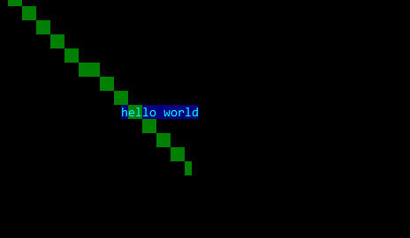

# Yummy Console
YummyConsole is a console drawing framework for Windows that holds an objective oriented design for you to use to easily draw on the console.


YummyConsole allows you to up your console application game! With YummyConsole you can in much easier fashion draw ASCII art, draw with colors, and even have overlapping objects all at your control!

## Use in your project

[](https://www.nuget.org/packages/YummyConsole/) [](https://www.nuget.org/packages/YummyConsole/)

YummyConsole is available on the NuGet platform. So it's super simple to install. The package name is simply `YummyConsole`

https://www.nuget.org/packages/YummyConsole/

#### Install via Visual Studio

You can in a very simple manner add the package in Visual Studio via their NuGet UI.

To do so, right click your project of choice in the Solution Explorer, and select `Manage NuGet Packages...`. Then in the new NuGet tab that just opened, select the `Browse` tab and in the search bar you type in `YummyConsole`. The package should show up and you just click install, and then it's just to start using the project!

For a more in-depth instruction of how to install a package, check out the [guide on Microsofts documentation (docs.microsoft.com)](https://docs.microsoft.com/en-us/nuget/tools/package-manager-ui#finding-and-installing-a-package)

## Example code

```csharp
class Program
{
	static void Main(string[] args)
	{

		new Text("hello world")
		{
			Position = new Vector2(20, 10),
			ZDepth = 0,
			foregroundColor = Color.LIGHT_CYAN,
			backgroundColor = Color.BLUE,
		};

		new Line(new Point(0, 0), new Point(30, 14))
		{
			ZDepth = -1,
			foregroundColor = null,
			backgroundColor = Color.GREEN,
		};

		Time.RunFrameTimer().Wait();
		
	}
}
```

#### Result:



## Contribute to Yummy Console

Contributing is easily made here via GitHub. Just fork the project and send pull requests!
